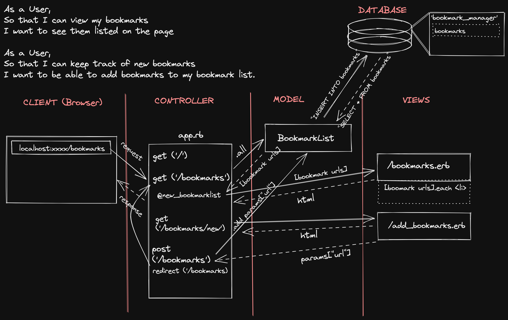

#Bookmark Manager Web App
Learning how to integrate databases into web apps for data persistence.

## User Stories
> As a user
> So that I can view my bookmarks
> I want to see them listed on the page.



> As a user
> So that I can keep track of new bookmarks
> I want to be able to add bookmarks to my bookmark list.

## Setting up the database:
1. Connect to ```psql```.
2. Create database through ```psql``` command ```CREATE DATABASE bookmark_manager;```
3. Connect to database using ```psql``` command ```\c bookmark_manager;```
4. Run the query saved in ```01_create_bookmarks_table.sql```

## Setting up the *test* database:
1. Connect to ```psql```.
2. Create database through ```psql``` command ```CREATE DATABASE bookmark_manager_test;```
3. Connect to database using ```psql``` command ```\c bookmark_manager_test;```
4. Run the query saved in ```02_create_bookmarks_table_test.sql```

## Adding the title column to the bookmarks table
1. Connect to ```psql```.
2. Connect to database using ```psql``` command ```\c bookmark_manager;```
3. Run query saved in ```03_add_title_col_to_bookmarks_table.sql```
N.B. also do this for bookmark_manager_test table, too.