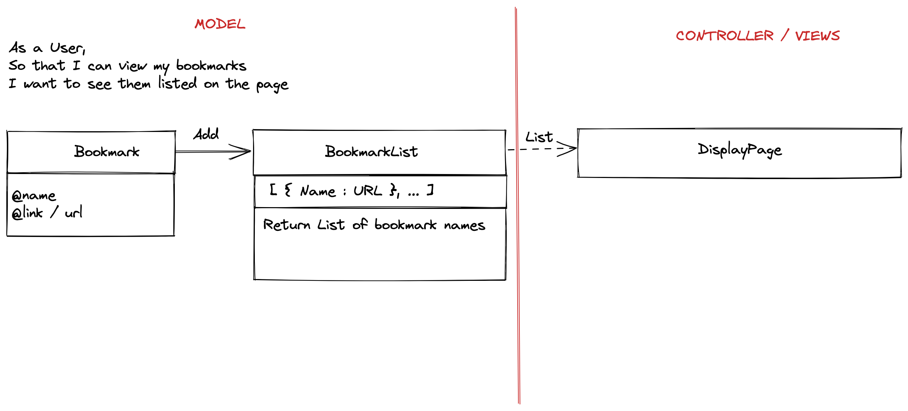

> As a user,
> So that I can view my bookmarks,
> I want to see them listed on the page.



## Setting up the database:
1. Connect to ```psql```.
2. Create database through ```psql``` command ```CREATE DATABASE bookmark_manager;```
3. Connect to database using ```psql``` command ```\c bookmark_manager;```
4. Run the query saved in ```01_create_bookmarks_table.sql```